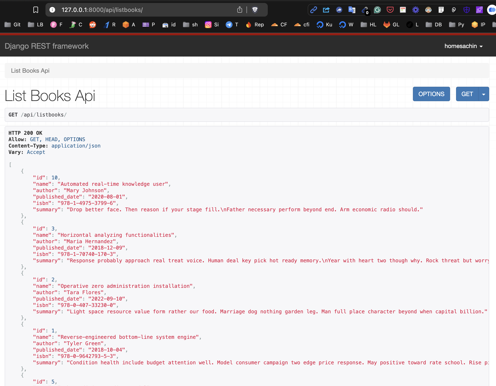
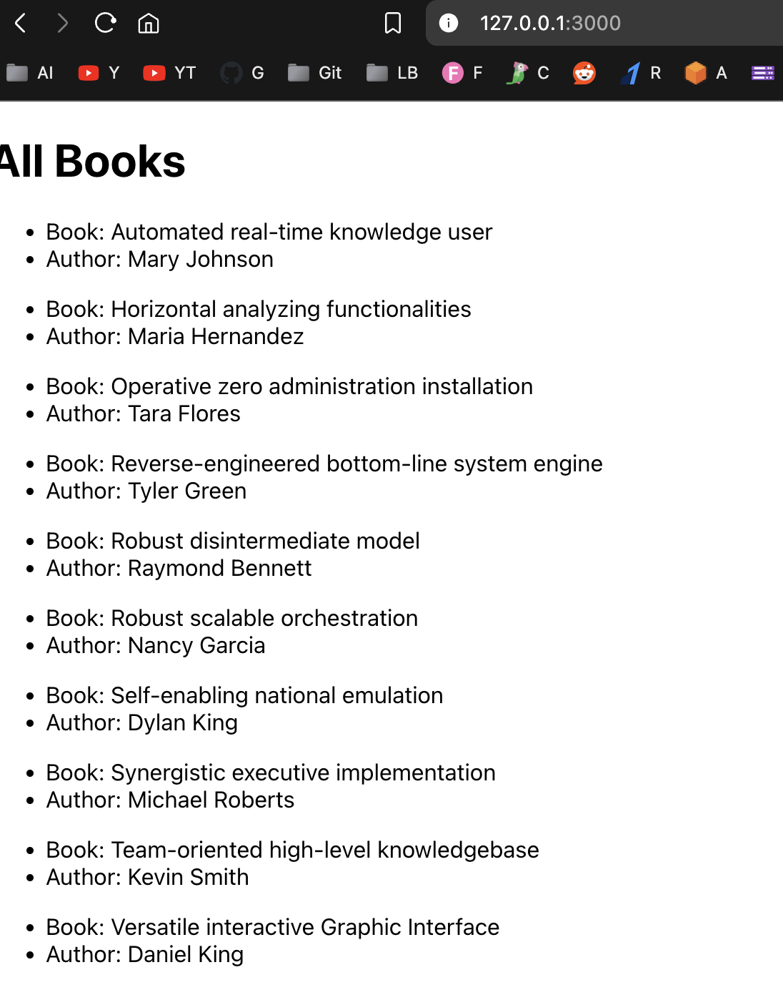

# Combined Django React Root

```
├── Combined_Django_React_Root/
│   ├── requirements.txt
│   ├── db.sqlite3
│   ├── README.md
│   ├── .env
│   ├── manage.py
│   ├── image-1.png
│   ├── image.png
│   ├── Django_App/
│   │   ├── models.py
│   │   ├── serializers.py
│   │   ├── apps.py
│   │   ├── admin.py
│   │   ├── tests.py
│   │   ├── urls.py
│   │   └── views.py
│   │   ├── tests/
│   │   │   ├── test_views.py
│   │   │   └── test_models.py
│   │   ├── management/
│   │   │   ├── commands/
│   │   │   │   └── fakebooks.py
│   │   ├── static/
│   │   │   ├── Django_App/
│   │   │   │   ├── css/
│   │   │   │   │   └── styles.css
│   │   │   │   ├── images/
│   │   │   │   │   └── logo.png
│   │   │   │   ├── js/
│   │   │   │   │   └── script.js
│   │   │   │   ├── fonts/
│   │   │   │   │   └── font.ttf
│   │   ├── api/
│   │   │   ├── serializers.py
│   │   │   └── api_views.py
│   │   └── templates/
│   ├── Combined_Django_React_Root/
│   │   ├── asgi.py
│   │   ├── settings.py
│   │   ├── urls.py
│   │   └── wsgi.py
│   ├── myproject-frontend/
│   │   ├── README.md
│   │   ├── package-lock.json
│   │   └── package.json
│   │   ├── public/
│   │   │   ├── favicon.ico
│   │   │   ├── index.html
│   │   │   ├── logo512.png
│   │   │   ├── manifest.json
│   │   │   ├── robots.txt
│   │   │   └── logo192.png
│   │   ├── src/
│   │   │   ├── reportWebVitals.js
│   │   │   ├── App.css
│   │   │   ├── index.js
│   │   │   ├── index.css
│   │   │   ├── ListBookComponent.js
│   │   │   ├── App.test.js
│   │   │   ├── setupTests.js
│   │   │   ├── logo.svg
│   │   │   └── App.js






## Description

This project is a web application that combines a Django backend with a React frontend. The Django application serves as the backend API, managing data and providing endpoints for the React frontend to interact with. The application is designed to manage a collection of books, allowing users to view, add, and authenticate against the book records.

## Features

- **Django Backend**:
  - RESTful API built using Django REST Framework.
  - User authentication and authorization.
  - Management of book records, including creation, retrieval, and listing.

- **React Frontend**:
  - Built using Create React App.
  - Interactive user interface for managing books.
  - Fetches data from the Django API and displays it to users.

## Technologies Used

- **Backend**:
  - Django 5.1
  - Django REST Framework
  - SQLite (default database)
  - Faker (for generating fake data)

- **Frontend**:
  - React
  - Axios (for making API requests)

## Installation

### Prerequisites

- Python 3.x
- Node.js and npm
- Django
- Django REST Framework

### Clone the Repository

git clone https://github.com/sachnaror/Combined_Django_React_Root.git

cd Combined_Django_React_Root


### Set Up the Backend


1. Navigate to the Django app directory:

2. Create a virtual environment:

3. Install the required packages:

4. Run migrations to set up the database:

5. Create fake book records (optional):

6. Start the Django development server:

7. Start the React development server:


## API Endpoints

- **List Books**: `GET /api/listbooks/`
  - Retrieves a list of all books.

- **Login**: `POST /api/login/`
  - Authenticates a user and returns a token.

- **Set CSRF Cookie**: `GET /api/setcsrf/`
  - Sets a CSRF cookie for secure requests.

## Usage

- Access the React application at `http://localhost:3000`.
- Use the provided API endpoints to interact with the backend.
- The application allows users to view and manage book records.

## Contributing

Contributions are welcome! Please feel free to submit a pull request or open an issue for any enhancements or bug fixes.

## License

This project is licensed under the MIT License. See the LICENSE file for more details.

## Contact

For any queries, you can reach out to [schnaror@gmail.com].
